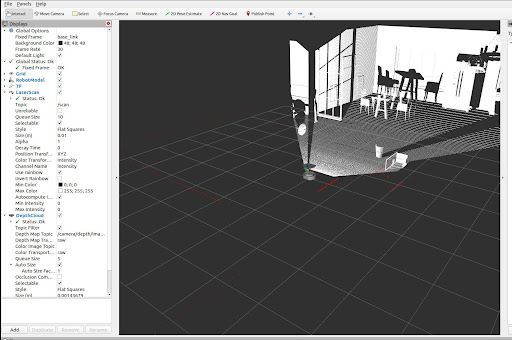
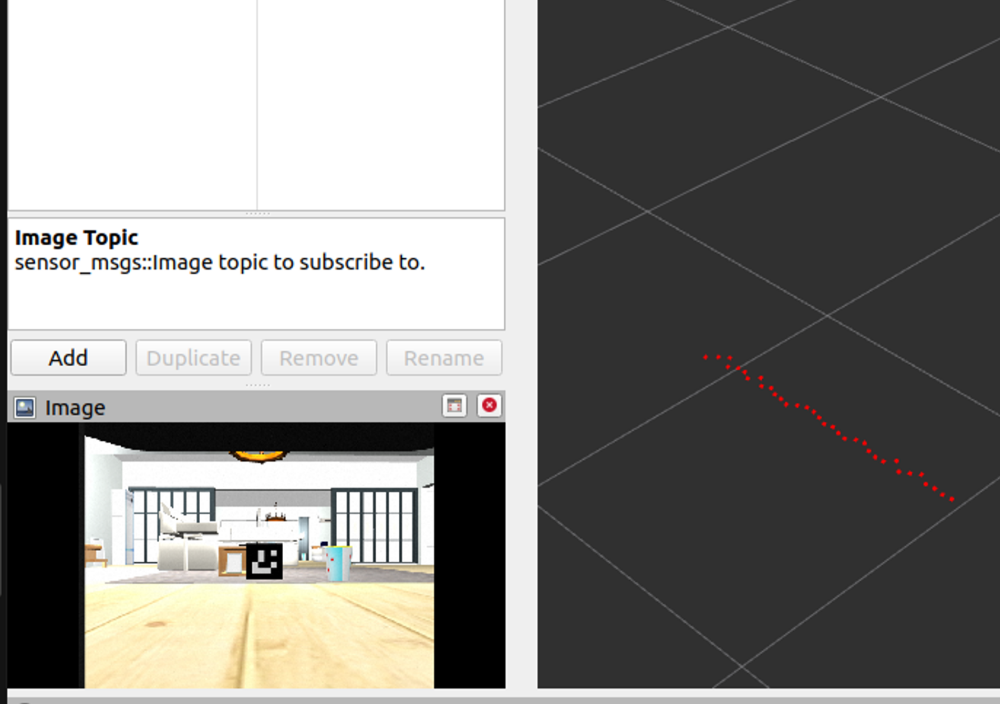
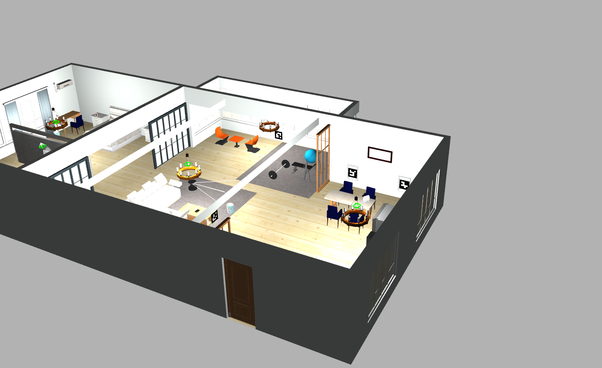
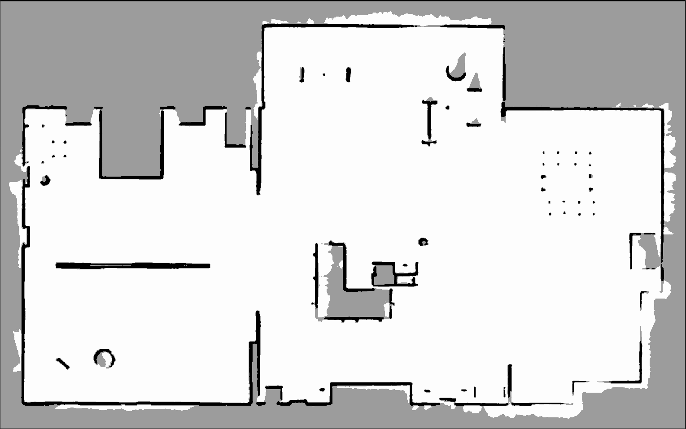

# Sim Task Aruco Navigator

AGV: Patel Shrey Gaurangbhai
Created time: August 11, 2024 7:13 AM
Tags: Product

## Initial setup

```powershell
mkdir –p ~/catkin_ws/src
cd ~/catkin_ws/src
catkin_init_workspace
cd ~/catkin_ws/
catkin_make
source ~/catkin_ws/devel/setup.bash
echo "source ~/catkin_ws/devel/setup.bash" >> ~/.bashrc
```

```powershell
echo $ROS_PACKAGE_PATH
```

Cloning the repo

```powershell
cd ~/catkin_ws/src
git clone https://github.com/tharun-selvam/sim_task_agv.git

Dependencies
git clone https://github.com/nilseuropa/realsense_ros_gazebo.git
git clone https://github.com/issaiass/realsense2_description.git
sudo apt-get install ros-noetic-teleop-twist-keyboard ros-noetic-urdf ros-noetic-xacro ros-noetic-rqt-image-view  ros-noetic-robot-state-publisher ros-noetic-joint-state-publisher-gui
```

Before moving on to launching the setup, navigate to the root of the workspace and make the workspace

```powershell
cd ~/catkin_ws
catkin_make
```

## Installing Cartographer

Link: [https://google-cartographer-ros.readthedocs.io/en/latest/compilation.html](https://google-cartographer-ros.readthedocs.io/en/latest/compilation.html)

Errors: I tried installing cartographer from other website which demnaded to install abseil-cpp folders separately ,which I installed atleast few times but due to copies of the folders installed it was giving error then I removed all the folders of abseil-cpp and then followed the above website.

## Running the simulations

In terminal 1

```powershell
roslaunch tortoisebotpromax_gazebo tortoisebotpromax_playground.launch
```

In terminal 2 (Rviz visualisation)

```powershell
roslaunch tortoisebotpromax_description display.launch
```

In terminal 3 (Teleoperation of the bot)

```powershell
rosrun teleop_twist_keyboard teleop_twist_keyboard.py
```

### Getting Tortoisebotpromax running ( all codes to be written on different terminals)

```powershell
roslaunch tortoisebotpromax_firmware bringup.launch pid:=true
```

```powershell
roslaunch tortoisebotpromax_firmware server_bringup.launch
```

1. **tortoisebotpromax_navigation.launch**: Initiates the autonomous navigation for exploration as well as localization modes Launching this script will get you:
- Cartographer Based Mapping/Localization
- Move base navigation tools Here's the command line:

```powershell
roslaunch tortoisebotpromax_navigation tortoisebotpromax_navigation.launch exploration:=true
```

- exploration:true enables the robot to move in SLAM mode. It can autonomously navigate in the environment while creating the map for the same.
- exploration:=false mode sets the robot in localization mode. It spawns itself in the map you provide and navigates within the space.
- When in localization mode, you can provide the map file by:

```powershell
roslaunch tortoisebotpromax_navigation tortoisebotpromax_navigation.launch exploration:=false map_file:/"location of your map file"
```

## Task 1

Just had to write this codes for visualising the Lidar point cloud in Rviz.

```cpp
$ roslaunch tortoisebotpromax_gazebo tortoisebotpromax_playground.launch
$ roslaunch tortoisebotpromax_description display.launch
```



## Task 2

For writing the Aruco Markers no such proper instructions were given whether to write it on my own or install the package. But the package was not working (as happened to my friends) I tried to search on internet but didnot get more sources who can teach how to code. So I took help of chat gpt and also one repo on github who had done the same task.





One can see the qr code type pictures on the walls that are aruco markers

- **Links:**
    
    [https://www.youtube.com/watch?v=aWmzhmfahh8&ab_channel=RafaelMu%C3%B1ozSalinas](https://www.youtube.com/watch?v=aWmzhmfahh8&ab_channel=RafaelMu%C3%B1ozSalinas)
    
    [https://www.youtube.com/watch?v=_gvvK6h-wxg&ab_channel=ProfessorDK](https://www.youtube.com/watch?v=_gvvK6h-wxg&ab_channel=ProfessorDK)
    
    [https://docs.opencv.org/4.x/d5/dae/tutorial_aruco_detection.html](https://docs.opencv.org/4.x/d5/dae/tutorial_aruco_detection.html)
    
    **Useful Repo:**
    
    [https://github.com/maker-ATOM/Robonautica-AMR/tree/master](https://github.com/maker-ATOM/Robonautica-AMR/tree/master)
    

[aruco_marker_detector.py]

[waypoints.json]

Only one code to add to the teminal after doing the running simulations part the launch file that I created(launh_aruco.launch) under aruco_marker_teleop

```powershell
Roslaunch aruco_marker_teleop launch_aruco.launch
```

## Task 3

Generating map using cartographer

After running these codes given in running the simulation:

To save the map

```powershell
rosrun map_server map_saver -f map
```



## Task 4

The logic behind this was to take the robot to the position that are stored in the waypoints.json file. Though I was not able to code in python or cpp but I asked the gpt to apply the logic.

[waypoint_navigator_sp.py](waypoint_navigator_sp.py)

[launcher.launch](launcher.launch)

The code is running with some issues sometimes it doesn’t reach the required position.

## Repo and useful links:

https://github.com/tharun-selvam/sim_task_agv

http://wiki.ros.org/ROS/Tutorials

[http://wiki.ros.org/rviz/UserGuide](http://wiki.ros.org/rviz/UserGuide)
